Dissecting the Lottery-Like Anomaly: Evidence from China

This version: September 2023

Ming Gu  
School of Economics and WISE  
Xiamen University  
E-mail: guming@xmu.edu.cn

Yi Hu  
School of Finance  
Nanjing Audit University  
E-mail: huyinau@nau.edu.cn

Zhitao Xiong  
Wang Yanan Institute for Studies in Economics  
Xiamen University  
E-mail: xiongzt1995@163.com

We thank Haiqiang Chen, Conghui Hu, George J. Jiang, Wenjin Kang, Shi Li, Tse-Chun Lin, Dong Lou, Yan Luo, Zheng Qiao, Yu Shen, Jianfeng Yu, Lingling Zheng, Yinggang Zhou, participants in the 2023 CFRI & CIRF Joint Conference and seminar at Xiamen University for their valuable comments. All errors are our responsibility.

Dissecting the Lottery-Like Anomaly: Evidence from China

**Abstract**

This paper dissects the lottery-like anomaly in Chinese A-share stocks by decomposing total stock returns into overnight and intraday returns. Our findings indicate that the negative overnight returns are concentrated among lottery-like stocks, and the lottery-like anomaly is mainly driven by the overnight return component. Considering the unique Chinese institutional features, we further show that the lottery-like anomaly induced by overnight returns is more pronounced in stocks with high retail investors’ gambling preference and high limits of arbitrage. Overall, our results suggest that investors optimism and trading constraints have a substantial impact on market efficiency in China.

Keywords: Lottery-like anomaly; Overnight returns; Lottery preference; Limits of arbitrage  
JEL Code: G11, G12, G14

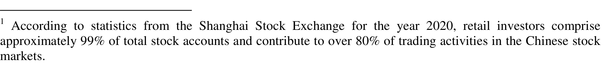

1 According to statistics from the Shanghai Stock Exchange for the year 2020, retail investors comprise approximately 99% of total stock accounts and contribute to over 80% of trading activities in the Chinese stock markets.

2 The Chinese stock markets enforce stringent trading restrictions, including the “T+1” trading rule and short-sale constraints. The “T+1” trading rule (Guo, Li, and Tu, 2012) prohibits investors from selling stocks bought on the same day. While short-sale constraints were partially relaxed at the end of 2010, retail investors still face significant barriers to engage in short-selling transactions.

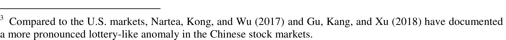
^3 Compared to the U.S. markets, Nartea, Kong, and Wu (2017) and Gu, Kang, and Xu (2018) have documented a more pronounced lottery-like anomaly in the Chinese stock markets.

first explanation, “clientele effects”, explores how different types of investors trade at different times and hold different assets. Previous studies indicate that individuals tend to exhibit a preference for gambling in their investment decision-making (Shefrin and Statman, 2000; Conrad, Kapaida, and Xing, 2014; Gao and Lin, 2015). Specifically, we find that lottery-like stocks attract higher intraday net buying from retail investors, confirming their preference for such stocks. In particular, the lottery-like anomalies induced by overnight returns are more pronounced among stocks that exhibit high levels of retail investors’ gambling preferences. These findings suggest that the gambling preference of retail investors possibly explains our baseline results.

Second, existing studies show that limits of arbitrage play a significant role in explaining anomalies in stock markets (Shleifer and Vishny, 1997; Nagel, 2005; Lewellen, 2011; Chu, Hirshleifer, and Ma, 2020). In the Chinese stock markets, where strict trading restrictions are imposed, limits of arbitrage may pose a more significant concern for overvalued stocks. The implementation of arbitrage strategies becomes more challenging among stocks with high limits of arbitrage, resulting in a longer process for correcting the prices of overvalued stocks. Empirically, we find that the lottery-like anomalies driven by overnight returns are predominantly observed among stocks with high limits of arbitrage, suggesting that trading constraints may reinforce the pricing effect of investors optimism on lottery-like stocks.

Furthermore, the third explanation examines the impact of news. Generally, more macro and micro news are released during the overnight period, leading to higher risks associated with systematic and idiosyncratic volatility during this time. Liu et al. (2020) indicate that investors have a stronger preference for lottery-like stocks leading up to firms’ earnings announcements. However, our analysis does not find any significant difference in the return of lottery-like anomalies between news and non-news periods. In addition, the firm-specific news does not affect the pricing of lottery-like characteristics either. These findings thereby

^5 Existing literature has shown that lottery-like assets have significant negative returns relative to non-lottery assets in the stock markets (Boyer, Mitton, and Vorkink, 2010; Bali, Cakici, and Whitelaw, 2011; Da, Liu, and Schaumburg, 2014; Bali et al., 2017; An et al., 2020), options and OTC markets (Xing, Zhang, and Zhao, 2010; Conrad, Dittmar, and Ghysels, 2013; Boyer and Vorkink, 2014; Eraker and Ready, 2015).

The rest of this paper is organized as follows. Section 2 describes the empirical sample, variables construction, and methodology. Section 3 presents the decomposition of lottery-like anomalies. Section 4 provides plausible explanations, and Section 5 concludes.

**2. Data and methodology**

*2.1 Samples and variable construction*

This study contains three main data sources. Stock returns, tick-by-tick trade and quote, company financial information, and analyst coverage are from the China Stock Market and Accounting Research Database (CSMAR). The Chinese and U.S. stock market index data are from the Wind Database (WIND). The financial news data and the disclosure time of financial statements are from the Chinese Research Data Services Platform (CNRDS). To ensure sufficient stocks in the cross section, we choose the sample from January 2000 to December 2021. The initial sample includes all Chinese A-share firms listed on the Shanghai and Shenzhen Stock Exchanges. We conduct the following data cleaning under the standard practice of empirical asset pricing (Liu, Stambaugh, and Yuan, 2019): (i) eliminating stocks with special treatment (ST) and particular transfer (PT); (ii) eliminating companies in the financial industry; (iii) eliminating companies that have been listed for less than one year; (iv) eliminating companies with negative sale revenues, book equities or book assets.

Following the approach of LPS (2019), we decompose the stock-level daily total returns into two components: intraday and overnight returns. The decomposition equations are as follows:

$$
\begin{align*}
Ret\_total_{d} &= Close_{d} / Close_{d-1} - 1 \\
Ret\_intraday_{d} &= Close_{d} / Open_{d} - 1 \\
Ret\_overnight_{d} &= (1 + Ret\_total_{d}) / (1 + Ret\_intraday_{d}) - 1
\end{align*}
$$

where $Ret\_total_{d}$, $Ret\_intraday_{d}$, and $Ret\_overnight_{d}$ represent the firm-level total returns,

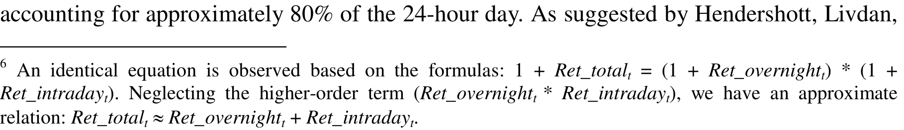
proximately 80% of the 24-hour day. As suggested by Hendershott, Livdan,

[^8]: Qiao and Dam (2020) and Zhang (2020) suggest that the “T+1” trading rule might explain the significant negative overnight returns observed in the Chinese market portfolio.

reports the results sorted by intraday returns in the current month. Similarly, stocks with higher intraday returns have significantly higher intraday returns and lower overnight returns in the following month.

<Table 1>

<Figure 1>

To further confirm the persistence of overnight and intraday returns, Figure 1 presents the $t$-statistics of Fama and French five-factor risk-adjusted overnight and intraday returns for the long-short portfolio D10-D1, sorted by overnight or intraday returns with varying lag periods. The analysis expands on the findings in Table 1 by examining different month gaps between the ranking period and the holding period, ranging from one month to twelve months. As seen in Figure 1, the $t$-statistics for these four long-short portfolios are statistically significant, indicating a strong persistence in overnight and intraday returns.

In sum, Table 1 and Figure 1 demonstrate the robust persistence of overnight and intraday returns in the Chinese stock markets. These findings agree with the concept of clientele effects (LPS, 2019; Chui, Subrahmanyam, and Titman, 2022), which suggests that different types of investors trade at different times and hold different assets.

---

### 3. Decomposition of Lottery-like Anomaly

This section examines the pricing of lottery-like characteristics. We first decompose the total returns of lottery-like anomalies to explore the main driver of individual anomalies. Then we construct the composite lottery-like index and discuss its relationship with the cross-section of stock overnight and intraday returns.

#### 3.1 Return decomposition of single lottery-like anomaly

*Existing literature suggests that investors with a gambling preference tend to overvalue*

^9 Since the maximum daily return is capped at 10% in China, we measure the lottery characteristics by calculating the average of the five highest daily returns rather than relying on the maximum daily return.

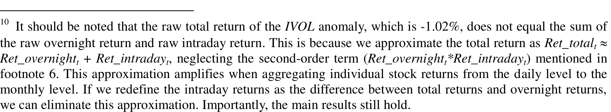

10 It should be noted that the raw total return of the IVOL anomaly, which is -1.02%, does not equal the sum of the raw overnight return and raw intraday return. This is because we approximate the total return as $Ret_{total} \approx Ret_{overnight} + Ret_{intraday}$, neglecting the second-order term ($Ret_{overnight} * Ret_{intraday}$), mentioned in footnote 6. This approximation amplifies when aggregating individual stock returns from the daily level to the monthly level. If we redefine the intraday returns as the difference between total returns and overnight returns, we can eliminate this approximation. Importantly, the main results still hold.

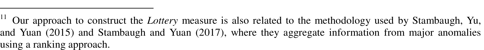
^11 Our approach to construct the Lottery measure is also related to the methodology used by Stambaugh, Yu, and Yuan (2015) and Stambaugh and Yuan (2017), where they aggregate information from major anomalies using a ranking approach.

^12 To construct the composite lottery-like index, we first convert each indicator into its corresponding z-score each month. For instance, with the idiosyncratic volatility indicator (IVOL), we obtain the order variable r by sorting stocks based on their IVOL value every month. Then, we define the z-score corresponding to IVOL as $z(IVOL) = (r-\mu)/\sigma$, where μ represents the mean of r in the cross-section and σ represents the standard deviation of r in the cross-section. Next, we sum up the z-scores of the four indicators. Finally, we normalize the sum value using the z-score standardization method to obtain the composite lottery-like index (Lottery).

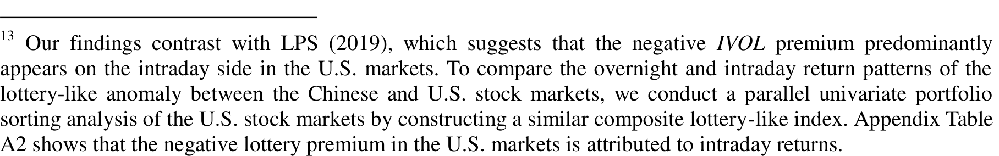

13 Our findings contrast with LPS (2019), which suggests that the negative IVOL premium predominantly appears on the intraday side in the U.S. markets. To compare the overnight and intraday return patterns of the lottery-like anomaly between the Chinese and U.S. stock markets, we conduct a parallel univariate portfolio sorting analysis of the U.S. stock markets by constructing a similar composite lottery-like index. Appendix Table A2 shows that the negative lottery premium in the U.S. markets is attributed to intraday returns.

where the dependent variables $R_{i,t+1}$ are the next month’s total returns $Ret\_total$, overnight returns $Ret\_overnight$, and intraday returns $Ret\_intraday$. The explanatory variable $Lottery_{i,t}$ is the composite lottery-like index ($Lottery$). Control variables include the market beta ($BETA$), market capitalization ($SIZE$), book-to-market ratio ($BM$), return on equity ($ROE$), asset growth rate ($INV$), and cumulative returns over the past 12 months ($MOM$).

<Table 5>

Column (1) in Table 5 shows that the coefficient of the composite lottery-like index ($Lottery$) is -0.464 ($t$-statistic = -6.73), indicating that $Lottery$ negatively predicts the next month total returns. More importantly, we find a significantly negative coefficient of $Lottery$ (-0.552 with $t$-statistic = -14.30) in the second column, suggesting its significant predictive power for overnight returns. However, the coefficient of $Lottery$ in the third column is insignificant (0.086 with $t$-statistic = 1.39), indicating no significant association with intraday returns. These findings support the notion that the lottery-like anomaly is primarily driven by its overnight component, consistent with the results presented in Table 4.

Overall, this section reveals two stylized facts about the lottery-like anomaly and overnight returns in the Chinese stock markets. First, the negative overnight returns are mainly concentrated among lottery-like stocks. Second, the lottery-like anomaly is essentially an overnight phenomenon. The return pattern, where lottery-like stocks exhibit lower total returns than non-lottery-like stocks, is mainly driven by the overnight return component.

---

**4. Plausible explanations**

This section offers three plausible explanations to understand our empirical findings. We first investigate the clientele effects on the baseline results, especially retail investors’ gambling preferences. Second, we examine the effect of limits of arbitrage on the pricing of the lottery-like anomaly. Third, we explore whether firm-level news plays a role in driving

^14 LPS (2019) show that individual investors in the U.S. markets are more likely to initiate trades near the market open, while institutional investors exhibit a higher tendency to trade significantly at the market close. This distinction in trading behavior represents one aspect of clientele effects. In our study, we focus on another aspect of clientele effects, specifically investigating whether different types of investors exhibit varying preferences for lottery-like stocks.

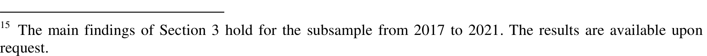
The main findings of Section 3 hold for the subsample from 2017 to 2021. The results are available upon request.

<Table 6>

The first two columns of Table 6 show that *Lottery* is positively associated with the next-month retail investors’ order imbalance, indicating a preference for purchasing lottery-like stocks among individuals. For example, when including control variables in column (2), the coefficient of *Lottery* is 0.740 (*t*-statistic = 14.36), suggesting that retail investors are more likely to be net buyers of lottery-like stocks during the intraday period. While the last two columns of Table 6 indicate that institutional investors do not exhibit a preference for lottery-like stocks. The coefficient of *Lottery* is -0.440 (*t*-statistic = -2.74) in column (4), suggesting that institutional investors are more likely to be net sellers of lottery-like stocks. The results of Table 6 confirm the gambling preference of retail investors in the Chinese stock markets.\(^{17}\)

<Figure 2>

Furthermore, we examine whether the gambling preference of retail investors varies across intraday windows. In each half-hour intraday trading window, we calculate the order imbalance of retail investors as the dependent variable. Then, we redo the Fama-MacBeth regressions as in Table 6. Figure 2 reports the regression coefficients of *Lottery* for each of the eight half-hour windows. All coefficients are significantly positive, indicating that retail investors consistently act as net buyers of lottery-like stocks during the intraday period.

Interestingly, the regression coefficient of *Lottery* in the last half-hour window is substantially higher than those in the other windows, suggesting that retail investors have an even stronger preference for buying lottery-like stocks near the market close.\(^{18}\)

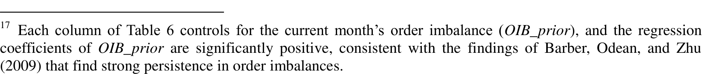

---
17 Each column of Table 6 controls for the current month’s order imbalance (*OIB_prior*), and the regression coefficients of *OIB_prior* are significantly positive, consistent with the findings of Barber, Odean, and Zhu (2009) that find strong persistence in order imbalances.

18 We believe that such a pattern is affected by the “T+1” trading rule in China. Under this rule, investors who purchase stocks near the market close have the option to sell them on the next trading day, compared to buying stocks at the opening of the next day. This option is particularly attractive to short-term speculators with a gambling preference. Thus, retail investors are more inclined to buy lottery-like stocks near the market close, as it allows for more convenient selling. The enthusiasm of retail investors for purchasing lottery-like stocks near

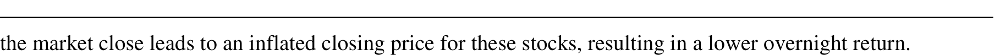
the market close leads to an inflated closing price for these stocks, resulting in a lower overnight return.

In Table 7, the long-short portfolios exhibit risk-adjusted total returns of -0.25% and -1.19% in the tercile portfolios of low *OIB_retail* and high *OIB_retail*, respectively. The total return difference in the long-short portfolios between these two subsamples is -0.95% (*t*-statistic = -2.17), indicating that the lottery anomaly is more pronounced in the portfolio with a high retail investors’ order imbalance. The overnight return difference of long-short portfolios between the two subsamples is -1.27% (*t*-statistic = -3.08); however, the corresponding intraday return difference is 0.26% (*t*-statistic = 0.51). These results suggest that the impact of retail investors’ gambling preference on the lottery-like anomalies is mainly concentrated in the overnight component rather than the intraday component.

In addition to the portfolio-level analysis, Table 8 reports the value-weighted Fama-MacBeth regressions as follows:

$$
R_{i, t+1} = \alpha_t + \beta_1 Lottery_{i,t} * OIB\_retail_{i,t} + \beta_2 Lottery_{i,t} + \beta_3 OIB\_retail_{i,t} + \gamma_t Controls_{i,t} + \epsilon_{i, t+1}
$$

where the dependent variables $R_{i, t+1}$ are the next month’s total returns $Ret\_total$, overnight returns $Ret\_overnight$, and intraday returns $Ret\_intraday$, respectively. The explanatory variables are the composite lottery-like index (*Lottery*), retail investors’ order imbalance (*OIB_retail*), and their interaction term. Control variables include market beta (*BETA*), market capitalization (*SIZE*), book-to-market ratio (*BM*), return on equity (*ROE*), asset growth rate (*INV*), and cumulative returns over the past 12 months (*MOM*).

<Table 8>

Table 8 finds the significantly negative regression coefficients of *Lottery* in the first two columns, while the coefficient is insignificant in the third column. These results are consistent with our previous findings, suggesting that the negative overnight returns are primarily observed among lottery-like stocks. Of particular interest is the coefficient of the interaction term *Lottery* $*$ *OIB_retail*, which are -0.018 (*t*-statistic = -2.95) in Column (1), -0.018 (*t*-statistic = -4.09) in Column (2), and 0.001 (*t*-statistic = 0.12) in Column (3), respectively.

19 In Column (1), the regression coefficients of OIB_retail are significantly negative, indicating that stocks with net buying from retail investors experience significantly negative returns. These results suggest that Chinese retail investors cannot accurately predict future stock price movements, consistent with Jones et al. (2023), which employs comprehensive proprietary account-level data to construct the order imbalance of retail investors.

To examine the impact of limits of arbitrage on the pricing of lottery-like characteristics, we construct a comprehensive measure, namely the limits-of-arbitrage index ($LAI$). Following the approach of Gu, Kang, and Xu (2018), we select six binary indicators that capture transaction restrictions and costs in the Chinese stock markets. The first three indicators are unique features in the Chinese stock markets, including whether touching the daily price limit ($LAHIT$), the availability of short selling ($LAMTSS$), and the availability of index future ($LACSI$). The other three indicators are more commonly used in the literature, including Amihud (2002) illiquidity ($LAAMIHU D$), trading volume ($LAVOL$), and analyst coverage ($LACOV$).$^{20}$ For each stock in each month, we average the available limits-of-arbitrage dummy variables to derive the $LAI$, which ranges from zero to one. A higher $LAI$ indicates greater limits of arbitrage for an individual stock.

<Table 9>

Similar to Table 7, we conduct a 3*5 two-way portfolio sorting based on the limits-of-arbitrage index ($LAI$) and the lottery-like index ($Lottery$) to investigate the role of limits of arbitrage in Table 9. The return differences of long-short portfolios between the low and high limits-of-arbitrage subsamples are -0.97% (t-statistic = -2.66), -0.86% (t-statistic = -6.81), and -0.03% (t-statistic = -0.10) for the total, overnight, and intraday returns, respectively. These results indicate that the negative total and overnight returns of the lottery-like anomaly are more pronounced when limits of arbitrage are high. However, we do not observe a similar pattern for intraday returns.

We also employ Fama-MacBeth regressions to examine the impact of limits of arbitrage on the pricing of the lottery-like characteristics as follows:

$$
R_{i,t+1} = \alpha_t + \beta_1 Lottery_{i,t} * LAI_{i,t} + \beta_2 Lottery_{i,t} + \beta_3 LAI_{i,t} + \gamma_t Controls_{i,t} + \epsilon_{i,t+1}
$$

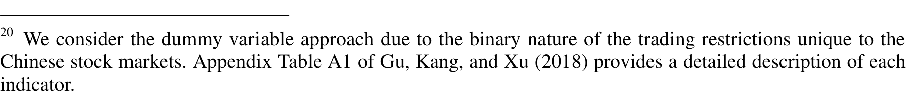

20 We consider the dummy variable approach due to the binary nature of the trading restrictions unique to the Chinese stock markets. Appendix Table A1 of Gu, Kang, and Xu (2018) provides a detailed description of each indicator.

21 To address concerns regarding the composite limits-of-arbitrage index (*LAI*) being dominated by a single indicator, we construct an alternative *LAI* by dropping one indicator from the original set of six. We then repeat the Fama-MacBeth regressions as shown in Table 10. The results in Appendix Table A5 confirm the findings from Table 10. The regression coefficients of the interaction term *Lottery* $\ast$ *LAI* remain significantly negative for total and overnight returns. However, the regression coefficient of the interaction term is insignificant for intraday returns.

Meanwhile, a company’s information disclosure can influence investors’ information acquisition and trading behaviors (Goldstein and Yang, 2015; Xiong and Yang, 2021). If a company tends to release unfavorable information outside of trading hours, it may incentivize individual investors to engage in private trading based on their private negative news at the subsequent market opening, thereby reinforcing negative overnight returns.

Moreover, Engelberg, McLean, and Pontiff (2018) suggest that investors often hold overly optimistic expectations regarding the cash flows of certain firms. When new information is revealed, investors adjust their biased beliefs, leading to changes in prices and observed return predictability. Thus, we further investigate the impact of firm-specific news on the pricing of lottery-like characteristics. To obtain firm-specific news data, we utilize financial media information from the Chinese Research Data Services Platform (CNRDS). Each news item in this database is categorized as positive, neutral, or negative. We aggregate the news information at the monthly level and create two dummy variables: *Good_News* and *Bad_News*. The variable *Good_News* (*Bad_News*) is assigned a value of one if the average news score of a stock is positive (negative) in month $t$ and zero otherwise. If no news is released in month $t$, both *Good_News* and *Bad_News* are set to zero. Controlling for firm-specific news, we conduct Fama-MacBeth regressions and report the results in Appendix Table A7. The regression coefficients of $Lottery * Good\_News$ and $Lottery * Bad\_News$ are statistically insignificant across all specifications. This suggests that firm-specific news does not significantly affect the return pattern of lottery-like anomalies. Based on these findings, we can conclude that our main results are not significantly affected by news effects.

---

**5. Conclusion**

This paper examines lottery-like anomalies in China and investigates the returns associated with lottery-like characteristics into their overnight and intraday components. Our findings reveal several important patterns. First, contrary to developed markets, we observe negative average overnight returns in China that exhibit strong persistence. Second, these negative overnight returns are mainly concentrated in lottery-like stocks, and the lottery-like anomaly is mostly driven by the overnight returns component. Third, we establish that the

negative overnight returns of lottery-like stocks are more pronounced among stocks with high retail investors’ gambling preference and high limits of arbitrage.

Our results are in line with Kumar (2009) that lottery-like characteristics are more attractive to speculative investors with a gambling preference and with Miller’s (1977) view that prices are dominated by optimists when limits of arbitrage exist. Specifically, trading constraints may reinforce the pricing effect of investors optimism on lottery-like stocks. Due to the joint effects of investors optimism and trading constraints, lottery-like stocks are more likely to be overpriced at the end of the trading day. When trading restrictions are lifted on the following day, prices adjust to lower levels, resulting in more negative overnight returns for lottery-like stocks and further amplifying the significance of the lottery-like anomalies.

Our findings have implications for both academics and policymakers. The patterns observed in overnight and intraday returns can influence the understanding and exploration of market anomalies. Researchers can further explore other types of anomalies during overnight and intraday periods using the return decomposition method proposed by LPS (2019) to gain deeper insights into these patterns. Our findings also highlight the importance of reducing security mispricing. Policymakers and regulators may consider relaxing trading constraints to facilitate price discovery and improve market efficiency.

**References**

Aboody, D., Even-Tov, O., Lehavy, R., and Trueman, B., 2018, Overnight returns and firm-specific investor sentiment, _Journal of Financial and Quantitative Analysis_ 53, 485-505.

Akbas, F., Boehmer, E., Jiang, C., and Koch, P. D., 2022, Overnight returns, daytime reversals, and future stock returns, _Journal of Financial Economics_ 145, 850-875.

Allen, F., Qian, J., Shan, C., and Zhu, J., 2023, Dissecting the Long-term Performance of the Chinese Stock Market, _Journal of Finance_, Forthcoming.

Amihud, Y., 2002, Illiquidity and stock returns: cross-section and time-series effects, _Journal of Financial Markets_ 5, 31-56.

An, L., Wang, H., Wang, J., and Yu, J., 2020, Lottery-like anomalies: The role of reference-dependent preferences, _Management Science_ 66, 473-501.

Ang, A., Hodrick, R. J., Xing, Y., and Zhang, X., 2006, The cross - section of volatility and expected returns, _Journal of Finance_ 61, 259-299.

Asness, C. S., Frazzini, A., and Pedersen, L. H., 2019, Quality minus junk, _Review of Accounting Studies_ 24, 34-112.

Bali, T. G., Cakici, T., and Whitelaw, R., 2011, Maxing Out: Stocks as Lotteries and the Cross-section of Expected Returns, _Journal of Financial Economics_ 99, 427-446.

Bali, T. G., Brown, S. J., Murray, S., and Tang, Y., 2017, A lottery-demand-based explanation of the beta anomaly, _Journal of Financial and Quantitative Analysis_ 52, 2369-2397.

Barber, B. M. and Odean, T., 2008, All that glitters: The effect of attention and news on the buying behavior of individual and institutional investors, _Review of Financial Studies_ 21, 785-818.

Barber, B. M., Odean, T., and Zhu, N., 2009, Do retail trades move markets? _Review of Financial Studies_ 22, 151-186.

Barberis, N., Huang, M., and Santos, T., 2001, Prospect theory and asset prices, _Quarterly Journal of Economics_ 116, 1-53.

Barberis, N. and Huang, M., 2008, Stocks as lotteries: The implications of probability weighting for security prices, _American Economic Review_ 98, 2066-2100.

Bekaert, G., Harvey, CR, and Mondino, T., 2023, Emerging equity markets in a globalized world, Netspar Discussion Paper.

Berkman, H., Koch, P. D., Tuttle, L., and Zhang, Y. J., 2012, Paying attention: Overnight returns and the hidden cost of buying at the open, _Journal of Financial and Quantitative Analysis_ 47, 715-741.

Boehmer, E., Jones, C. M., Zhang, X., and Zhang, X., 2021, Tracking retail investor activity, _Journal of Finance_ 76, 2249-2305.

Bogousslavsky, V., 2021, The cross-section of intraday and overnight returns, _Journal of Financial Economics_ 141, 172-194.

Bordalo, P., Gennaioli, N., and Shleifer, A., 2013, Salience and asset prices, _American Economic Review_ 103, 623-628.

Boyer, B., Mitton, T., and Vorkink, K., 2010, Expected idiosyncratic skewness, _Review of Financial Studies_ 23, 169-202.

Boyer, B. and Vorkink, K., 2014, Stock options as lotteries, _Journal of Finance_ 69, 1485-1527.

Brunnermeier, M. K., Gollier, C., and Parker, J. A., 2007, Optimal beliefs, asset prices, and the preference for skewed returns, _American Economic Review_ 97, 159-165.

Carpenter, J. N., Lu, F., and Whitelaw, R. F., 2021, The real value of China’s stock market, _Journal of Financial Economics_ 139, 679–696.

Chen, A. Y. and Velikov, M., 2022, Zeroing in on the expected returns of anomalies, _Journal of Financial and Quantitative Analysis_, 1-83.

Chen, J., Jiang, F., Liu, Y., and Tu, J., 2017, International volatility risk and Chinese stock return predictability, _Journal of International Money and Finance_ 70, 183-203.

Chu, Y., Hirshleifer, D., and Ma, L., 2020, The causal effect of limits to arbitrage on asset pricing anomalies, _Journal of Finance_ 75, 2631-2672.

Chui, A. C., Subrahmanyam, A., and Titman, S., 2022, Momentum, reversals, and investor clientele, _Review of Finance_ 26, 217-255.

Conrad, J., Dittmar, R. F., and Ghysels, E., 2013, Ex ante skewness and expected stock returns, _Journal of Finance_ 68, 85-124.

Conrad, J., Kapadia, N., and Xing, Y., 2014, Death and jackpot: Why do individual investors hold overpriced stocks? _Journal of Financial Economics_ 113, 455-475.

Da, Z., Liu, Q., and Schaumburg, E., 2014, A closer look at the short-term return reversal, _Management Science_ 60, 658-674.

Dimmock, S. G., Kouwenberg, R., Mitchell, O. S., and Peijnenburg, K., 2021, Household portfolio under-diversification and probability weighting: Evidence from the field, _Review of Financial Studies_ 34,4524-4563.

Doran, J. S., Jiang, D., and Peterson, D. R., 2012, Gambling preference and the new year effect of assets with lottery features, _Review of Finance_ 16, 685-731.

Engelberg, J., McLean, R. D., and Pontiff, J., 2018, Anomalies and news, _Journal of Finance_ 73, 1971-2001.

Eraker, B. and Ready, M., 2015, Do investors overpay for stocks with lottery-like payoffs? An examination of the returns of OTC stocks, _Journal of Financial Economics_ 115, 486-504.

Fama, E. F. and French, K. R., 1993, Common risk factors in the returns on stocks and bonds, _Journal of Financial Economics_ 33, 3-56.

Fama, E. F. and French, K. R., 2015, A five-factor asset pricing model, _Journal of Financial Economics_ 116, 1-22.

Fama, E. F. and MacBeth, J. D., 1973, Risk, return, and equilibrium: Empirical tests, _Journal of Political Economy_ 81, 607-636.

Friedman, M. and Savage, L. J., 1948, The utility analysis of choices involving risk, _Journal of Political Economy_ 56, 279-304.

Gao, X. and Lin, T. C., 2015, Do individual investors treat trading as a fun and exciting gambling activity? Evidence from repeated natural experiments, _Review of Financial Studies_ 28, 2128–2166.

Ghysels, E., Plazzi, A., and Valkanov, R., 2016, Why invest in emerging markets? The role of conditional return asymmetry, _Journal of Finance_ 71, 2145-2192.

Goldstein, I. and Yang, L., 2015, Information diversity and complementarities in trading and

Gromb, D. and Vayanos, D., 2010, Limits of arbitrage, *Annual Review of Financial Economics* 2, 251-275.

Gu, M., Kang, W., and Xu, B., 2018, Limits of arbitrage and idiosyncratic volatility: Evidence from China stock market, *Journal of Banking and Finance* 86, 240-258.

Guo, M., Li, Z., and Tu, Z., 2012, A unique “T + 1 trading rule” in China: Theory and evidence, *Journal of Banking and Finance* 36, 575-583.

Han, B. and Kumar, A., 2013, Speculative retail trading and asset prices, *Journal of Financial and Quantitative Analysis* 48, 377-404.

Hendershott, T., Livdan, D., and Rösch, D., 2020, Asset pricing: A tale of night and day. *Journal of Financial Economics* 138, 635-662.

Heston, S. L., Korajczyk, R. A., and Sadka, R., 2010, Intraday patterns in the cross-section of stock returns, *Journal of Finance* 65, 1369-1407.

Hou, K., Xue, C., and Zhang, L., 2015, Digesting anomalies: An investment approach, *Review of Financial Studies* 28, 650-705.

Hou, K., Xue, C., and Zhang, L., 2020, Replicating anomalies, *Review of Financial Studies* 33, 2019-2133.

Huang, S., Huang, Y., and Lin, T. C., 2019, Attention allocation and return co-movement: Evidence from repeated natural experiments, *Journal of Financial Economics* 132, 369-383.

Hvidkjær, S., 2008, Small trades and the cross-section of stock returns, *Review of Financial Studies* 21, 1123-1151.

Jiang, H., Li, S. Z., and Wang, H., 2021, Pervasive underreaction: Evidence from high-frequency data, *Journal of Financial Economics* 141, 573-599.

Jiang, L., Liu, J., Peng, L., and Wang, B., 2022, Investor attention and asset pricing anomalies, *Review of Finance* 26, 563-593.

Jones, C. M., Shi, D., Zhang, X., and Zhang, X., 2023, Understanding retail investors: Evidence from China, Working Paper.

Kelley, E. K. and Tetlock, P. C., 2013, How wise are crowds? Insights from retail orders and stock returns, *Journal of Finance* 68, 1229-1265.

Kumar, A., 2009, Who gambles in the stock market? *Journal of Finance* 64, 1889-1933.

Leippold, M., Wang, Q., and Zhou, W., 2022, Machine learning in the Chinese stock market, *Journal of Financial Economics* 145, 64-82.

Lewellen, J., 2011, Institutional investors and the limits of arbitrage, *Journal of Financial Economics* 102, 62-80.

Li, Z., Liu, L. X., Liu, X., and Wei, K. C., 2023, Replicating and digesting anomalies in the Chinese A-share market, *Management Science*, Forthcoming.

Liao, J., Peng, C., and Zhu, N., 2022, Extrapolative bubbles and trading volume, *Review of Financial Studies* 35, 1682-1722.

Liu, B., Wang, H., Yu, J., and Zhao, S., 2020, Time-varying demand for lottery: Speculation ahead of earnings announcements, *Journal of Financial Economics* 138, 789-817.

Liu, J., Stambaugh, R. F., and Yuan, Y., 2019, Size and value in China, *Journal of Financial Economics* 134, 48-69.

Liu, J., Hope, O. K., and Hu, D., 2023, Earnings announcements in China:

Overnight-intraday disparity, *Journal of Corporate Finance*, 102471.

Liu, H., Peng, C., Xiong, W. A., and Xiong, W., 2022, Taming the bias zoo, *Journal of Financial Economics* 143, 716-741.

Lou, D., Polk, C., and Skouras, S., 2019, A tug of war: Overnight versus intraday expected returns, *Journal of Financial Economics* 134, 192-213.

Markowitz, H., 1952, The utility of wealth, *Journal of Political Economy*, 60, 151-158.

Miller, E. M., 1977, Risk, uncertainty, and divergence of opinion, *Journal of Finance* 32, 1151-1168.

Nagel, S., 2005, Short sales, institutional investors and the cross-section of stock returns, *Journal of Financial Economics* 78, 277-309.

Nartea, G. V., Kong, D., and Wu, J., 2017, Do extreme returns matter in emerging markets? Evidence from the Chinese stock market, *Journal of Banking and Finance* 76, 189-197.

Newey, W. K. and West, K. D., 1987, A simple, positive semi-definite, heteroskedasticity and autocorrelation consistent covariance matrix, *Econometrica* 55, 703-708.

Novy-Marx, R. and Velikov, M., 2016, A taxonomy of anomalies and their trading costs, *Review of Financial Studies* 29, 104-147.

Qiao, K. and Dam, L., 2020, The overnight return puzzle and the “T+1” trading rule in Chinese stock markets, *Journal of Financial Markets* 50, 100534.

Shefrin, H. and Statman, M., 2000, Behavioral portfolio theory, *Journal of Financial and Quantitative Analysis* 35, 127-151.

Shleifer, A. and Vishny, R. W., 1997, The limits of arbitrage, *Journal of Finance* 52, 35-55.

Stambaugh, R. F., Yu, J., and Yuan, Y., 2015, Arbitrage asymmetry and the idiosyncratic volatility puzzle, *Journal of Finance* 70, 1903-1948.

Stambaugh, R. F. and Yuan, Y., 2017, Mispricing factors, *Review of Financial Studies* 30, 1270-1315.

Xing, Y., Zhang, X., and Zhao, R., 2010, What does the individual option volatility smirk tell us about future equity returns? *Journal of Financial and Quantitative Analysis* 45, 641-662.

Xiong, Y. and Yang, L., 2021, Disclosure, competition, and learning from asset prices, *Journal of Economic Theory* 197,105331.

Zhang, B., 2020, T+1 trading mechanism causes negative overnight return, *Economic Modelling* 89, 55-71.

**Figure 1 The t-statistics of overnight and intraday returns of long-short portfolios with different lag periods**

The figure reports the t-statistics of Fama and French five-factor risk-adjusted overnight and intraday returns of long-short portfolio D10-D1 sorted by overnight or intraday returns with different lag periods. The lag months shown by the X-axis refer to the month gaps between the ranking month and the holding month (from one month to twelve months). The red solid (blue dotted) line corresponds to using lagged overnight returns to predict future overnight returns (intraday returns). The green dashed (purple dashed) line corresponds to using lagged intraday returns to predict future intraday returns (overnight returns). The sample period is from January 2000 to December 2021. The t-statistics are calculated based on Newey and West (1987) standard errors.

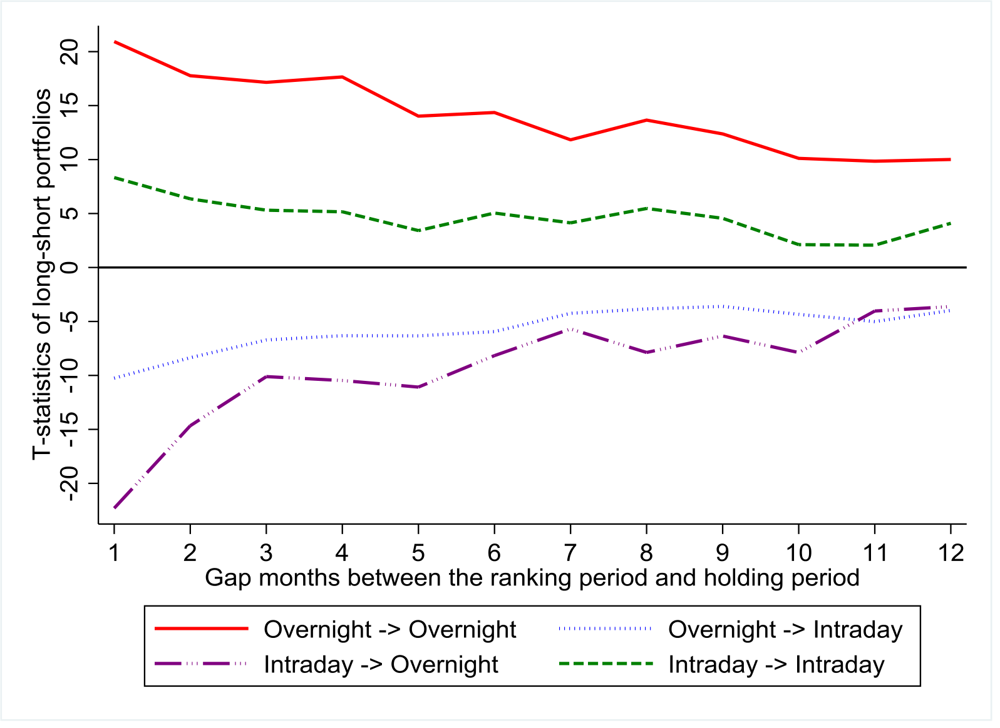

**Figure 2 The regression coefficients of Lottery in each of the half-hour trading windows**

We calculate the order imbalance of retail investors using each of the half-hour trading windows during the intraday period. Then we conduct the Fama-MacBeth regressions of investors’ order imbalance in the next month on the current month Lottery as follows:
$$
OIB\_retail_{i,k,t+1} = \alpha_k + \beta_k Lottery_{i,t} + \gamma_k Controls_{i,t} + \varepsilon_{i,k,t+1}
$$
where the dependent variable $OIB\_retail_{i,k,t+1}$ refers to the order imbalance of retail investors in the $k$-th half-hour trading window. The explanatory variable $Lottery$ is the composite lottery-like index ($Lottery$). Control variables include the current month corresponding order imbalance ($OIB\_prior$), market beta ($BETA$), market capitalization ($SIZE$), book-to-market ratio ($BM$), return on equity ($ROE$), asset growth rate ($INV$), and cumulative returns over the past 12 months ($MOM$). The sample period is from January 2017 to December 2021.

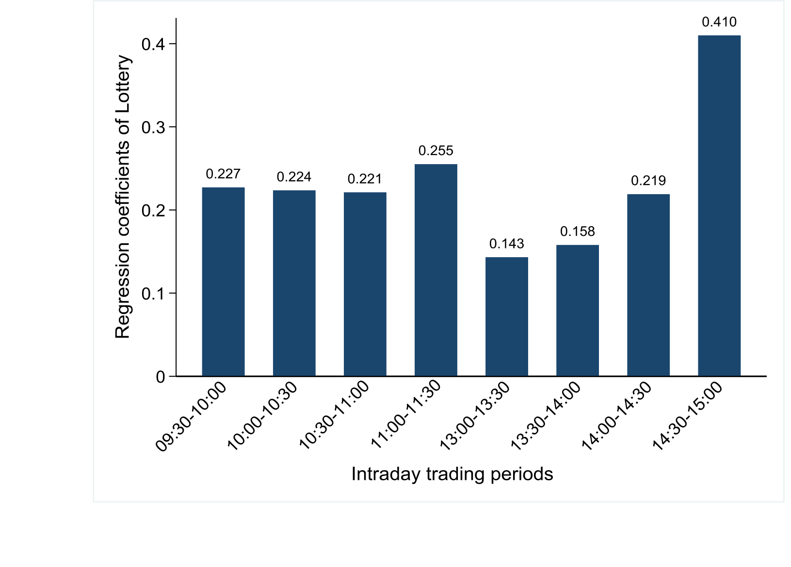

**Table 1 The persistence of overnight/intraday returns**

This table reports the persistence of overnight/intraday returns. In Panel A, at the end of each month, we sort all stocks into decile portfolios based on their overnight returns in the current month, where D1 has the lowest and D10 has the highest overnight returns. We then long D10 and short D1 to form the long-short portfolio D10-D1. The first three columns report the value-weighted average raw, CAPM, and Fama and French five-factor risk-adjusted (FF5) overnight returns of each portfolio in the next month. The next three columns show the value-weighted average raw and risk-adjusted intraday returns of each portfolio in the next month. Similarly in Panel B, we sort all stocks into decile portfolios based on their intraday returns in the current month and report the value-weighted average raw and risk-adjusted overnight returns and intraday returns of each portfolio in the next month. The sample period is from January 2000 to December 2021. The t-statistics in parentheses are calculated based on Newey and West (1987) standard errors. *, **, and *** indicate significance at the 10%, 5%, and 1% levels, respectively.

---

**Panel A Sorting based on overnight returns in the current month**

|                | \multicolumn{3}{c|}{Next month $Ret\_overnight$} | \multicolumn{3}{c|}{Next month $Ret\_intraday$} |
|:--------------:|:-----:|:-----:|:-----:|:-----:|:-----:|:-----:|
|                | Raw   | CAPM  | FF5   | Raw   | CAPM  | FF5   |
| D1             | -3.41 | -2.08 | -1.75 | 4.07  | 2.07  | 1.61  |
| D10            | -0.63 | 0.73  | 0.68  | 1.09  | -0.96 | -0.82 |
| D10-D1         | 2.78*** | 2.81*** | 2.43*** | -2.99*** | -3.04*** | -2.43*** |
| $t$-stat       | (24.68) | (24.60) | (20.93) | (-11.07) | (-11.39) | (-10.25) |

---

**Panel B Sorting based on intraday returns in the current month**

|                | \multicolumn{3}{c|}{Next month $Ret\_overnight$} | \multicolumn{3}{c|}{Next month $Ret\_intraday$} |
|:--------------:|:-----:|:-----:|:-----:|:-----:|:-----:|:-----:|
|                | Raw   | CAPM  | FF5   | Raw   | CAPM  | FF5   |
| D1             | -0.66 | 0.70  | 0.90  | 1.74  | -0.30 | -0.53 |
| D10            | -3.35 | -2.10 | -2.13 | 3.60  | 1.72  | 1.81  |
| D10-D1         | -2.69*** | -2.80*** | -3.02*** | 1.86*** | 2.02*** | 2.34*** |
| $t$-stat       | (-20.37) | (-20.25) | (-22.30) | (6.34) | (6.83) | (8.33) |

Table 2 Overnight/Intraday return components of lottery-like anomalies

We decompose the total returns into the overnight and intraday returns for each of the four lottery-like anomalies. The lottery-like characteristics include idiosyncratic volatility (IVOL), idiosyncratic skewness (ISKEW), five highest daily returns (MAX5), and short-term reversal (REV). Taking IVOL as an example, at the end of each month, we sort all stocks into decile portfolios based on their idiosyncratic volatility in the current month, where D1 has the lowest and D10 has the highest IVOL. Then we long D10 and short D1 to form the long-short portfolio D1-D10. The table reports the raw and Fama and French five-factor risk-adjusted total, overnight, and intraday returns. The sample period is from January 2000 to December 2021. The t-statistics in parentheses are calculated based on Newey and West (1987) standard errors. *, **, and *** indicate significance at the 10%, 5%, and 1% levels, respectively.

| Anomaly | \multicolumn{3}{c}{Raw returns} | \multicolumn{3}{c}{FF5 risk-adjusted returns} |
|---------|:-------------:|:-------------:|:-------------:|:-------------:|:-------------:|:-------------:|
|         | $Ret_{total}$ | $Ret_{overnight}$ | $Ret_{intraday}$ | $Ret_{total}$ | $Ret_{overnight}$ | $Ret_{intraday}$ |
| **IVOL** | -1.02*** | -2.47*** | 1.65*** | -0.94*** | -1.99*** | 1.22*** |
| $t$-stat | (-3.84) | (-14.81) | (5.15) | (-3.38) | (-12.96) | (4.28) |
| **ISKEW** | -0.87*** | -0.90*** | 0.11 | -0.91*** | -0.76*** | -0.09 |
| $t$-stat | (-4.01) | (-7.73) | (0.46) | (-4.62) | (-6.89) | (-0.39) |
| **MAX5** | -0.88*** | -2.20*** | 1.46*** | -0.92*** | -1.76*** | 0.97*** |
| $t$-stat | (-2.77) | (-11.47) | (3.77) | (-2.65) | (-9.38) | (2.78) |
| **REV** | -1.43*** | -1.37*** | -0.01 | -1.17*** | -1.94*** | 0.88*** |
| $t$-stat | (-5.30) | (-10.78) | (-0.05) | (-4.57) | (-13.89) | (3.67) |

33_0.png

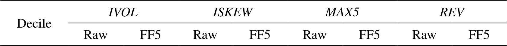

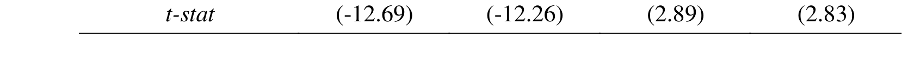

_stat_  (-12.69)  (-12.26)  (2.89)  (2.83)

**Table 6 Regressions of investors’ order imbalance on lottery-like index**

This table reports the Fama-MacBeth regressions of investors’ order imbalance in the next month on the current month lottery-like index as follows:

$$
OIB_{i,j+1} = \alpha_j + \beta_j Lottery_{i,j} + \gamma_j Controls_{i,j} + \varepsilon_{i,j+1}
$$

where the dependent variables $OIB_{i,j+1}$ include the order imbalance of retail investors $OIB_{retail}$ and the order imbalance of institutional investors $OIB_{institution}$ in the next month. The explanatory variable $Lottery$ is the composite lottery-like index ($Lottery$). Control variables include the current month corresponding order imbalance ($OIB_{prior}$), the market beta ($BETA$), market capitalization ($SIZE$), book-to-market ratio ($BM$), return on equity ($ROE$), asset growth rate ($INV$), and cumulative returns over the past 12 months ($MOM$). The sample period is from January 2017 to December 2021. The $t$-statistics in parentheses are calculated based on Newey and West (1987) standard errors. *, **, and *** indicate significance at the 10%, 5%, and 1% levels, respectively.

|                | \multicolumn{2}{c}{OIB\_retail} | \multicolumn{2}{c}{OIB\_institution} |
|----------------|------------------|------------------|----------------------|----------------------|
|                |                  |                  |                      |                      |
| Lottery        | 0.688***         | 0.740***         | -0.177               | -0.440***            |
|                | (14.71)          | (14.36)          | (-1.13)              | (-2.74)              |
| OIB_prior      | 0.316***         | 0.317***         | 0.085***             | 0.083***             |
|                | (23.75)          | (28.36)          | (6.52)               | (6.37)               |
| BETA           |                  | 0.248***         |                      | -0.322               |
|                |                  | (6.03)           |                      | (-1.38)              |
| SIZE           |                  | 0.224***         |                      | -0.013               |
|                |                  | (4.88)           |                      | (-0.04)              |
| BM             |                  | 0.116**          |                      | -1.268***            |
|                |                  | (2.22)           |                      | (-3.62)              |
| ROE            |                  | -4.639***        |                      | -7.108               |
|                |                  | (-5.46)          |                      | (-1.50)              |
| INV            |                  | -0.195***        |                      | 0.841***             |
|                |                  | (-4.21)          |                      | (3.22)               |
| MOM            |                  | -0.007***        |                      | 0.017***             |
|                |                  | (-5.61)          |                      | (3.88)               |
| Adj-$R^2$      | 0.103            | 0.120            | 0.011                | 0.019                |

38_0.png
_ Low  0.26  (0.51)

| Adj-$R^2$ | 0.165 | 0.083 | 0.149 |

40_0.png  
_ v -0.03 (-0.10)

\[
\text{lj-}R^2 \qquad 0.175 \qquad 0.097 \qquad 0.157
\]

**Appendix Table A1 Overnight/Intraday return components in Chinese and U.S. stock markets**

This table reports the mean value of total returns $Ret\_total$, overnight returns $Ret\_overnight$, and intraday returns $Ret\_intraday$ of major stock indexes in the Chinese and U.S. stock markets. The Chinese indexes include the Shanghai Stock Exchange Composite Index (SSE Composite), Shenzhen Stock Exchange Component Index (Shenzhen Component), and Shanghai-Shenzhen 300 Index (CSI300). The U.S. indexes include the Dow Jones, S&P 500, and NASDAQ indexes. The sample period is from January 2000 to December 2021. The $t$-statistics in parentheses are calculated based on Newey and West (1987) standard errors. *, **, and *** indicate significance at the 10%, 5%, and 1% levels, respectively.

| Index                | $Ret\_total$ (%) | $Ret\_overnight$ (%) | $Ret\_intraday$ (%) |
|----------------------|------------------|----------------------|---------------------|
| **Chinese Index**    |                  |                      |                     |
| SSE Composite        | 0.64             | -1.18***             | 1.82***             |
|                      | (1.13)           | (-4.18)              | (3.67)              |
| Shenzhen Component   | 0.90             | -0.83***             | 1.73***             |
|                      | (1.38)           | (-2.97)              | (2.89)              |
| CSI300               | 1.13             | -1.33***             | 2.45***             |
|                      | (1.48)           | (-4.52)              | (4.00)              |
| **U.S. Index**       |                  |                      |                     |
| Dow Jones            | 0.45*            | 0.07                 | 0.38*               |
|                      | (1.91)           | (0.74)               | (1.79)              |
| S&P500               | 0.48*            | 0.19**               | 0.28                |
|                      | (1.88)           | (2.19)               | (1.21)              |
| NASDAQ               | 0.60*            | 0.69***              | -0.10               |
|                      | (1.73)           | (3.36)               | (-0.32)             |

42_0.png

**Appendix Table A2 Decomposing the lottery anomaly returns in the U.S. stock markets**

We construct a similar composite lottery-like index (*Lottery*) for the U.S. stock markets and then redo the overnight/intraday returns decomposition as in Table 4. Specifically, at the end of each month, all stocks are sorted into decile portfolios based on their *Lottery* in the current month, where D1 has the lowest and D10 has the highest values. Then we long D10 and short D1 to form the long-short portfolio D10-D1. The table reports the value-weighted average raw and Fama and French five-factor risk-adjusted (FF5) total, overnight, and intraday returns for each portfolio. The sample period is from January 2000 to December 2021. The $t$-statistics in parentheses are calculated based on Newey and West (1987) standard errors. *, **, and *** indicate significance at the 10%, 5%, and 1% levels, respectively.

| U.S. Lottery Decile | \multicolumn{3}{c}{Raw returns} | \multicolumn{3}{c}{FF5 risk-adjusted returns} |
|---------------------|:----------:|:-------------:|:-------------:|:----------:|:-------------:|:-------------:|
|                     | $Ret_{total}$ | $Ret_{overnight}$ | $Ret_{intraday}$ | $Ret_{total}$ | $Ret_{overnight}$ | $Ret_{intraday}$ |
| D1 (non-lottery)    | 1.02        | 0.55          | 0.54          | 0.27       | -0.08         | 0.33           |
| D2                  | 0.92        | 0.55          | 0.46          | 0.16       | -0.09         | 0.23           |
| D3                  | 0.79        | 0.52          | 0.36          | 0.05       | -0.09         | 0.13           |
| D4                  | 0.79        | 0.59          | 0.29          | 0.01       | -0.03         | 0.03           |
| D5                  | 0.69        | 0.65          | 0.14          | -0.02      | 0.09          | -0.10          |
| D6                  | 0.53        | 0.63          | 0.01          | -0.15      | 0.08          | -0.22          |
| D7                  | 0.49        | 0.79          | -0.17         | -0.18      | 0.18          | -0.34          |
| D8                  | 0.47        | 0.91          | -0.30         | -0.09      | 0.35          | -0.40          |
| D9                  | 0.59        | 1.12          | -0.35         | 0.05       | 0.57          | -0.44          |
| D10 (lottery)       | 0.17        | 1.20          | -0.77         | -0.27      | 0.71          | -0.82          |
| D10-D1              | -0.84**     | 0.65***       | -1.32***      | -0.54**    | 0.79***       | -1.16***       |
| $t$-stat            | (-2.44)     | (2.63)        | (-4.21)       | (-2.55)    | (2.93)        | (-4.39)        |

44_0.png
*tt*    (-7.75)    (-13.63)    (2.24)    (2.87)

*tt*     (3.44)   (3.86)   (4.35)   (3.02)

_Controls_ Yes Yes Yes

**Appendix Table A6 Next month’s returns on lottery-like index controlling for earnings announcement effect**

This table reports the Fama-MacBeth regressions of next month’s stock returns on the current month’s composite lottery-like index during the months with or without firm-specific earnings announcements. Specifically, for each firm, according to whether there will be an earnings announcement in the current month, we divide the full sample period into two subsamples: earnings announcement month sample and non-earnings announcement month sample. Then, we redo the regression as in Table 5 for two subsamples. The sample period is from January 2000 to December 2021. The t-statistics in parentheses are calculated based on Newey and West (1987) standard errors. *, **, and *** indicate significance at the 10%, 5%, and 1% levels, respectively.

|                           | Earnings announcement months       | Excluding earnings announcement months |
|---------------------------|------------------------------------|----------------------------------------|
|                           | Ret_total | Ret_overnight | Ret_intraday | Ret_total | Ret_overnight | Ret_intraday |
|---------------------------|-----------|---------------|--------------|-----------|---------------|--------------|
| Lottery                   | -0.432*** | -0.505***     | 0.111        | -0.513*** | -0.564***     | 0.083        |
|                           | (-2.83)   | (-5.86)       | (0.85)       | (-7.55)   | (-12.93)      | (1.20)       |
| BETA                      | 0.455     | 0.459*        | -0.080       | 0.010     | 0.351***      | -0.458       |
|                           | (0.82)    | (1.68)        | (-0.14)      | (0.03)    | (3.12)        | (-1.31)      |
| SIZE                      | -0.601*** | 0.392***      | -1.048***    | -0.396*** | 0.295***      | -0.714***    |
|                           | (-3.14)   | (5.36)        | (-5.54)      | (-2.73)   | (6.37)        | (-5.38)      |
| BM                        | 0.166     | 0.354         | -0.248       | 0.011     | 0.020         | -0.003       |
|                           | (0.58)    | (1.11)        | (-0.64)      | (0.06)    | (0.17)        | (-0.01)      |
| ROE                       | 10.739*** | 10.810***     | -0.752       | 11.440*** | 6.169***      | 4.667        |
|                           | (2.66)    | (4.10)        | (-0.18)      | (4.76)    | (4.64)        | (1.52)       |
| INV                       | 0.115     | 0.449**       | -0.358       | 0.204     | 0.186         | -0.033       |
|                           | (0.32)    | (2.23)        | (-0.93)      | (1.27)    | (1.48)        | (-0.16)      |
| MOM                       | 0.011*    | -0.001        | 0.012*       | 0.003     | -0.009***     | 0.013***     |
|                           | (1.79)    | (-0.28)       | (1.80)       | (0.79)    | (-5.24)       | (3.42)       |
| Adj-$R^2$                 | 0.191     | 0.136         | 0.182        | 0.184     | 0.105         | 0.161        |

dj-$R^2$    0.194   0.115   0.176